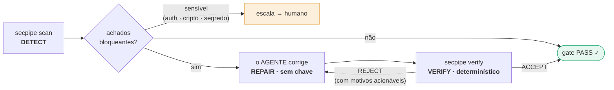
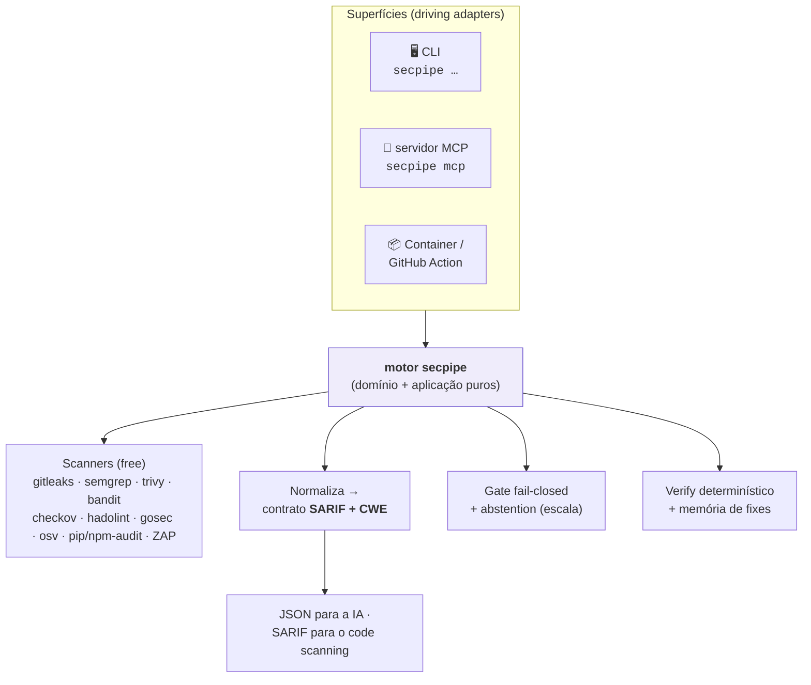
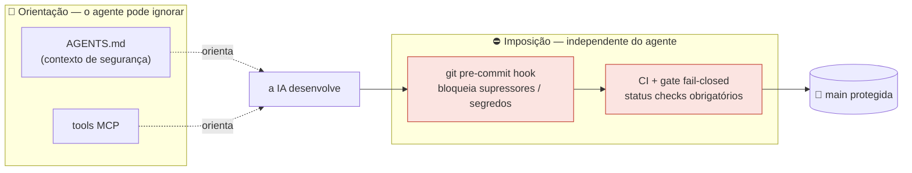
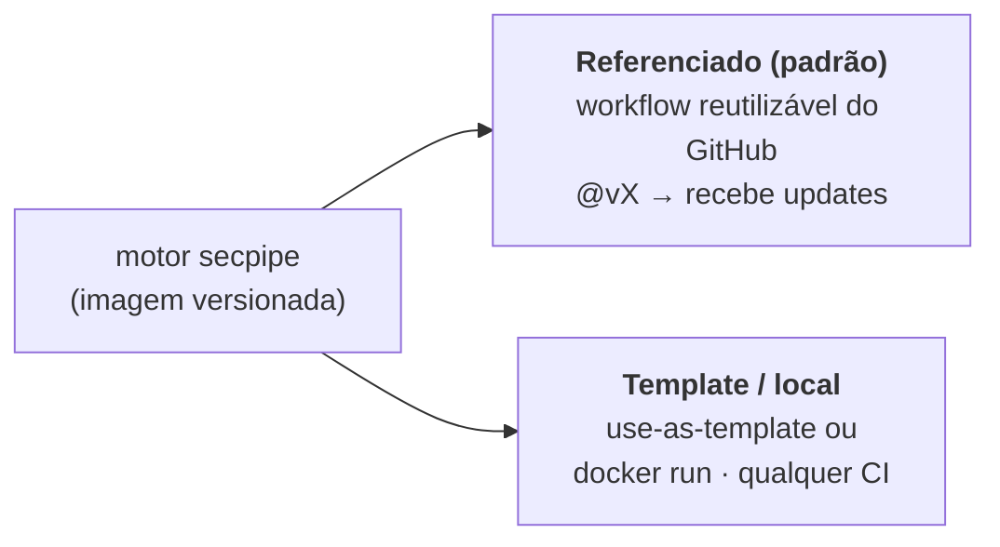
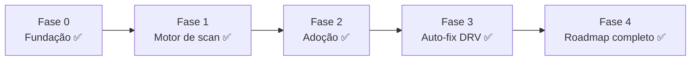

<div align="center">

# 🛡️ secpipe

### A esteira de segurança de custo zero que a sua **IA opera sozinha** — para todo projeto feito por IA já nascer seguro.

[](https://github.com/pablodlz/secpipe-ai/actions/workflows/ci-security.yml)
[](LICENSE)
[](https://github.com/pablodlz/secpipe-ai/pkgs/container/secpipe-ai)
[](pyproject.toml)
[](#-mcp--a-interface-nativa-do-agente)


**Agnóstico de linguagem · Agnóstico de IA · Sem chave · Self-hosted · Compõe as melhores ferramentas free**

</div>

---

> **A IA escreve código rápido — e injeta vulnerabilidades em escala.** O secpipe faz a *mesma* IA que
> escreve o seu código **achar, corrigir e verificar** essas vulnerabilidades, guiada por regras que ela
> não consegue burlar em silêncio. Sem chave de API. Sem conta paga. Sem humano no meio nos 80% de rotina —
> só nos 20% arriscados.

O secpipe é um **motor de DevSecOps projetado para ser operado por um agente de IA** (Claude Code, Cursor,
Copilot, Aider…). Você o aplica a um projeto *antes* de começar o desenvolvimento; a partir daí, a IA do
projeto desenvolve **seguro por padrão** — escaneando, corrigindo e verificando o próprio trabalho atrás de
guardrails impostos pelos seus git hooks e CI, não pela boa vontade da IA.

É **grátis por construção** (só scanners free/open-source), **roda em qualquer lugar** (container, qualquer CI
ou local) e funciona com **qualquer linguagem** e **qualquer IA**.

---

## ✨ Por que o secpipe é diferente

|  | **secpipe** | Copilot Autofix | Snyk / Mobb / Semgrep Assistant |
| --- | :---: | :---: | :---: |
| **Custo** | **US$ 0, self-hosted** | grátis só p/ OSS | pago / por consumo |
| **Precisa de chave de IA própria** | **Não** — o agente já roda | — | Sim (conta) |
| **Corrige achado de qualquer scanner** | **Sim** (SARIF+CWE) | só CodeQL | varia |
| **Operado pela própria IA (nativo em MCP)** | **Sim** | Não | Não |
| **Verificador que não confia na palavra da IA** | **Determinístico** (scanner + testes + anti-supressão) | — | — |
| **Imposição que a IA não burla** | **git hooks + CI** | — | — |
| **Roda offline / sem serviço externo** | **Sim** | Não (nuvem) | Não |

A sacada central: **o operador é a IA.** Por isso o secpipe não embute um LLM (e não precisa de chave) — ele
fornece os **achados, o juiz determinístico e os guardrails**; o agente de IA que já está rodando faz a correção.

---

## 🔁 Como funciona — o loop Detect → Repair → Verify



- **DETECT** — `secpipe scan` roda os scanners, normaliza cada resultado num contrato único (`cwe`, `severity`,
  `file`, `line`, `fingerprint`, `escalate`), dedup, e aplica um **gate fail-closed**.
- **REPAIR** — o agente de IA lê os achados estruturados e corrige com o próprio modelo (ou `secpipe fix` aplica
  codemods determinísticos nos mecânicos). **Sem chave.**
- **VERIFY** — `secpipe verify` é o **juiz determinístico e independente**: só aceita um fix se o scanner deixou
  de apontar, o diff **não adiciona supressão** e os testes passam. Quem aprova é a *máquina* — nunca a palavra
  do agente. O que for sensível é **escalado**, não corrigido automaticamente.

---

## 🚀 Início rápido

```bash
# 1. Instale o motor + scanners free (Windows / Linux / macOS)
python install.py            # ou: ./setup.sh  |  .\setup.ps1

# 2. Adote o secpipe em qualquer projeto (um comando)
secpipe init                 # grava .secpipe.yml + AGENTS.md + git hook + workflow de CI + .mcp.json

# 3. O loop
secpipe scan .               # DETECT — achados em JSON para a IA (ou --format sarif p/ o code scanning)
secpipe fix .                # REPAIR — aplica codemods determinísticos (o resto é com o agente)
secpipe verify .             # VERIFY — gate determinístico + anti-supressão + testes
```

Prefere zero instalação? A imagem publicada já traz **tudo** embutido:

```bash
docker run --rm -v "$PWD:/work" ghcr.io/pablodlz/secpipe-ai:latest scan /work
```

`secpipe init` é **plug-and-play**: zero-config funciona de cara com defaults fortes e seguros — o
`.secpipe.yml` é opcional e existe só para tunar, nunca para enfraquecer.

---

## 📋 Passo a passo — adicione o secpipe ao *seu* projeto

> **Quem faz o quê.** *Você* conecta o secpipe **uma vez** (alguns arquivos gerados, um commit). Daí em diante
> **o seu agente de IA opera** — ele lê o `AGENTS.md`, roda o loop e corrige os achados. **Nunca precisa de chave
> de API:** o operador é o agente que você já usa (Claude Code, Cursor, Copilot…), não um serviço pago.

**Pré-requisitos:** um repositório Git (GitHub recomendado) e **Docker** *ou* **Python 3.11+**.

### 1 · Instale o motor

Escolha um caminho:

```bash
# A) Zero instalação — a imagem publicada traz todos os scanners embutidos (melhor p/ CI)
docker pull ghcr.io/pablodlz/secpipe-ai:latest

# B) CLI + scanners locais — para rodar o loop na sua máquina
pip install git+https://github.com/pablodlz/secpipe-ai.git
python install.py     # instala os scanners free  (ou ./setup.sh | .\setup.ps1)
secpipe doctor        # mostra quais scanners estão no seu PATH
```

### 2 · Adote — um comando na raiz do repo

```bash
secpipe init
```

Ele detecta as suas linguagens e grava estes arquivos (idempotente — **nunca** sobrescreve o que você já tem):

| Arquivo | Para quê | Commitar? |
| --- | --- | --- |
| `.secpipe.yml` | sua lista de scanners + gate — **só para tunar**, não enfraquece os defaults | ✅ |
| `.github/workflows/security.yml` | o gate de CI — chama o motor reutilizável em `@v1` | ✅ |
| `AGENTS.md` | o contrato que a sua IA lê **antes de escrever código** | ✅ |
| `.mcp.json` | conecta o servidor MCP para o agente chamar o secpipe nativamente | ✅ |
| `CLAUDE.md` | shim que aponta o Claude Code para o `AGENTS.md` | ✅ |
| hook de pre-commit | guardrail anti-supressão — **integrado** ao seu `.pre-commit-config.yaml` (ou um git hook nativo) | ✅ |

### 3 · Commit & push — o gate entra no ar

```bash
git add .secpipe.yml .github/ AGENTS.md .mcp.json CLAUDE.md .pre-commit-config.yaml
git commit -m "chore(security): adota o secpipe"
git push
```

A cada push/PR, o `security.yml` roda `docker run …/secpipe-ai:latest scan` — todos os scanners, direto da
imagem **pública**, então o **seu CI não precisa de login nem segredo**. Qualquer achado **HIGH/CRITICAL**
**reprova o build** (fail-closed). Não há mais nada para configurar.

### 4 · Deixe a sua IA operar o loop

Enquanto você desenvolve, o agente roda **Detect → Repair → Verify** (localmente ou via MCP):

```bash
secpipe scan .     # DETECT  — achados JSON (com CWE) que a IA consome
secpipe fix .      # REPAIR  — codemods determinísticos; o agente corrige o resto
secpipe verify .   # VERIFY  — juiz determinístico: gate + anti-supressão + seus testes
```

O agente **não consegue** silenciar um achado para ficar verde (o guardrail abaixo bloqueia), e classes
sensíveis (auth / cripto / segredos) são **escaladas para você**, nunca corrigidas sozinhas.

### 5 · Escolha o modelo de adoção *(opcional)*

- **Referenciado (padrão)** — o `security.yml` pina `…/secpipe.reusable.yml@v1`; bump a tag para receber
  updates do motor. Melhor para a maioria.
- **Template / vendorizado** — use-as-template, ou só `docker run …` em qualquer CI (GitLab, Jenkins…). Melhor
  quando você não pode referenciar entre repos.

> **Esforço humano líquido:** um `secpipe init` + um commit. Todo o resto é o agente e o gate. Confira quando
> quiser com `secpipe doctor` e a aba **Actions** do seu repo.

---

## 🧩 Arquitetura — um motor, três superfícies

O secpipe é um núcleo pequeno e de domínio puro (Clean + Hexagonal) com adapters trocáveis e **três entrypoints
finos**. O CI/CD fala CLI/container; o agente de IA fala **MCP**.



**Compõe o melhor de cada, não reinventa.** Os scanners, a remediação (Codemodder) e as checagens de
supply-chain (OpenSSF Scorecard, StepSecurity Harden-Runner) são ferramentas free comprovadas. O valor do
secpipe é a **cola**: um contrato amigável à IA, o verificador determinístico, os guardrails e a interface
nativa do agente.

---

## 🔒 O guardrail: *quem guarda o guarda?*

Se a mesma IA escreve o código, roda o gate **e** corrige os achados, o que a impede de simplesmente… silenciar
um achado para ficar verde? Esse é o problema mais difícil da segurança operada por IA — e o secpipe o resolve
separando **orientação** (conselho que o agente pode ignorar) de **imposição** (estrutural, independente do agente):



- **Um fix nunca é "deixar o CI verde".** O pre-commit hook **bloqueia** qualquer diff que adicione supressores
  de linter ou um segredo staged. O gate é **fail-closed** (desconhecido/erro ⇒ bloqueia).
- **A política mora no motor**, não no repo do consumidor — a IA não reescreve a régua que a julga (e o
  `secpipe policy-check` reprova se ela tentar enfraquecer).
- **O verificador é determinístico** — evidência objetiva (scanner + testes), não a auto-avaliação do modelo.

*Essa lição foi aprendida na marra na segurança ofensiva (um guarda que ensinava o próprio bypass); o secpipe
embute a correção desde o commit zero.*

---

## 🤖 MCP — a interface nativa do agente

`secpipe init` registra um **servidor MCP** (`.mcp.json`). Qualquer agente compatível com MCP ganha tools de
primeira classe e conduz o loop com **JSON estruturado**, sem parsear shell:

| Tool | Para quê |
| --- | --- |
| `secpipe_scan` | DETECT — achados + veredito do gate |
| `secpipe_fix` | REPAIR — codemods determinísticos |
| `secpipe_verify` | VERIFY — juiz determinístico |
| `secpipe_recall` / `secpipe_remember` | memória de fixes verificados (padrões, nunca código) |
| `secpipe_doctor` | disponibilidade das ferramentas |
| `secpipe_threat_model` | scaffold de threat model STRIDE (keyless) |
| `secpipe_sbom` | Software Bill of Materials (CycloneDX/SPDX) |

O servidor é **JSON-RPC 2.0 sobre stdio, só stdlib** (zero dependência externa — menor superfície de
supply-chain, apropriado para uma ferramenta de segurança) e **local** por design. É a camada de *ergonomia*;
a imposição fica nos hooks + CI.

---

## 🛠️ Comandos

| Comando | O que faz |
| --- | --- |
| `secpipe init` | Adota o secpipe num projeto (config + `AGENTS.md` + hook + workflow + `.mcp.json`) |
| `secpipe scan [--format json\|sarif\|html\|md\|github] [--enrich] [--diff-base REF] [--reachability]` | Roda os scanners, normaliza, aplica o gate |
| `secpipe fix [--dry-run]` | Aplica codemods determinísticos |
| `secpipe verify [--base REF]` | Juiz determinístico: gate + anti-supressão + testes |
| `secpipe autofix --headless` | PR-bot de IA **opt-in, com chave**: corrige → verify determinístico → abre PR (nunca auto-merge) |
| `secpipe threat-model [--format md\|json\|threat-dragon]` | Threat model STRIDE do seu app (keyless; ciente de framework) |
| `secpipe import <file.sarif>` · `dast-import <zap.json>` | Normaliza qualquer SARIF externo / relatório ZAP no gate |
| `secpipe image <ref>` · `sbom [--format cyclonedx\|spdx]` · `badge` | Scan de imagem · SBOM · badge SVG |
| `secpipe report --defectdojo` | Exporta os achados para o DefectDojo (opt-in, com chave) |
| `secpipe config-validate` · `policy-lock` · `policy-check` · `waiver-list` | Ferramentas de política (anti-adulteração, exceções) |
| `secpipe hook` · `mcp` · `remember`/`recall` · `doctor` · `version` | Imposição · servidor MCP · memória de fixes · ferramentas · versão |

---

## 🧰 O que tem dentro (tudo free)

| Dimensão | Ferramentas / capacidades compostas |
| --- | --- |
| **SAST** | Semgrep CE · Bandit (Python) · **gosec** (Go) |
| **SCA** | Trivy · pip-audit · **npm-audit** · **osv-scanner** (multi-ecossistema) |
| **Segredos** | gitleaks (filesystem **+ histórico git completo**) |
| **IaC / containers** | Trivy · **Checkov** (Terraform/K8s/CFN) · **hadolint** (Dockerfile) · **`trivy image`** |
| **DAST** (opt-in) | OWASP ZAP — **baseline / full / autenticado** · correlação DAST↔SAST |
| **Dependências maliciosas** | **typosquat · dependency-confusion · install-hook** (heurística offline) |
| **Licenças** | política SPDX **deny/allow** (via Trivy) |
| **Priorização** | **EPSS + CISA KEV** (KEV bloqueia) · reachability-lite · triage hints |
| **Threat modeling** | scaffold STRIDE, keyless · **ciente de framework** · export **Threat Dragon** |
| **Remediação** | Codemodder (determinístico) · **PR-bot de IA headless** (opt-in, verificado) |
| **Motor de política** | **coverage gate** fail-closed · **policy-as-code** · **waivers** · **diff-scope** · **gate-integrity lock** |
| **Relatórios** | JSON · SARIF · HTML · Markdown · anotações do GitHub · badge · DefectDojo |
| **Supply-chain (motor)** | **SBOM (CycloneDX)** · **assinatura cosign keyless** · **provenance SLSA** · actions pinadas por SHA · OpenSSF Scorecard · Harden-Runner · Dependabot |

Ferramentas ausentes simplesmente `skip` (nunca quebram o run); um scanner que **erra** dispara o gate
**fail-closed**. A imagem publicada traz todos os scanners, é **assinada** (keyless) e o workflow reutilizável a
**pina por digest**.

---

## 📥 Modelos de adoção — GitHub-first, com um fallback



Os dois modos consomem o **mesmo motor versionado** — você adapta só um `.secpipe.yml` mínimo + um wrapper fino,
nunca a lógica. É assim que o secpipe se mantém reutilizável **sem drift**.

---

## 🛡️ Postura de segurança (ele come a própria comida de cachorro)

O próprio repositório do secpipe é seu **primeiro consumidor**: todo push roda a esteira nele mesmo.

- **Fail-closed em tudo** · segredos nunca commitados (gitleaks no CI + pre-commit)
- **Supply-chain endurecida** · todas as GitHub Actions **pinadas por SHA de commit** · binários da imagem
  verificados por **SHA-256** · imagem **assinada** (cosign keyless) + **SBOM** + **provenance SLSA**
- **OpenSSF Scorecard** + **Harden-Runner** (monitoramento de egress) + **Dependabot** · `main` protegida
- **Gate de qualidade estrito** em toda mudança · Ruff (inclui regras do Bandit) + mypy `--strict` + Bandit + testes

Veja o [`SECURITY.md`](SECURITY.md) e o threat model em [`docs/specs/03-security.md`](docs/specs/03-security.md).

---

## 📈 Status & roadmap

**Roadmap completo (v0.6.0):** **8+ scanners** (SAST/SCA/segredos/IaC/DAST/deps-maliciosas/licença/imagem) ·
priorização **EPSS + KEV** · **threat model STRIDE** (ciente de framework + Threat Dragon) · **Detect→Repair→Verify
keyless** + **PR-bot de IA headless** (opt-in) · **motor de política** completo (coverage-gate · policy-as-code ·
waivers · diff-scope · gate-integrity lock) · relatórios (JSON/SARIF/HTML/MD/badge/anotações) · export **DefectDojo**
· **SBOM + assinatura cosign keyless + provenance SLSA** · servidor MCP · imagem **assinada e pinada por digest** · CI verde.



O plano completo e as specs de design ficam em [`docs/specs/`](docs/specs/) (da fundação às features, incl. as
estratégias destiladas de prior art) e as decisões em [`docs/adr/`](docs/adr/).

---

## ❓ FAQ

**Preciso de uma chave de API OpenAI/Anthropic?** Não. A IA que opera o seu projeto já tem acesso a modelo — é
*ela* que corrige. O secpipe fornece os achados, o juiz determinístico e os guardrails. (Existe um modo **PR-bot
headless** opcional que chama um LLM sozinho — esse, sim, precisa de chave; é **opt-in e default-off**.)

**Quais linguagens?** Qualquer uma. O motor roda como container; os scanners são multi-linguagem. Os scanners
específicos de Python (Bandit, pip-audit) auto-habilitam quando Python é detectado; checkov/hadolint quando há
IaC; gosec para Go; npm-audit para JS.

**Quais agentes de IA?** Qualquer um. O `AGENTS.md` é o padrão neutro (com shims opcionais para
Claude/Cursor/Copilot), e o servidor MCP funciona com qualquer agente compatível com MCP. E o mais importante: a
imposição (hooks + CI) é **independente do agente**.

**É realmente free?** Sim — só scanners free/OSS, self-hosted, sem metering. `semgrep`/`codemodder` não rodam
nativo no Windows (rodam no container/CI Linux); todo o resto roda no Windows também.

**Ele consegue só silenciar achados para passar?** Não — esse é o design inteiro. Supressão é bloqueada no
commit, a política não é editável pelo consumidor (`policy-lock`), e o verificador é determinístico.

---

## 🤝 Contribuindo & Licença

Contribuições são bem-vindas — issues e PRs. Toda mudança passa pelo mesmo gate verde que o secpipe aplica a
todo o resto.

Licenciado sob **[Apache-2.0](LICENSE)** — permissiva, com concessão explícita de patente (apropriado para
ferramenta de segurança).

<div align="center">

*Feito para ser a melhor esteira de segurança de custo zero do mercado — operada por IA, para software feito por IA.*

</div>
