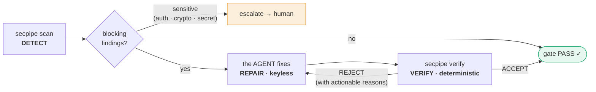
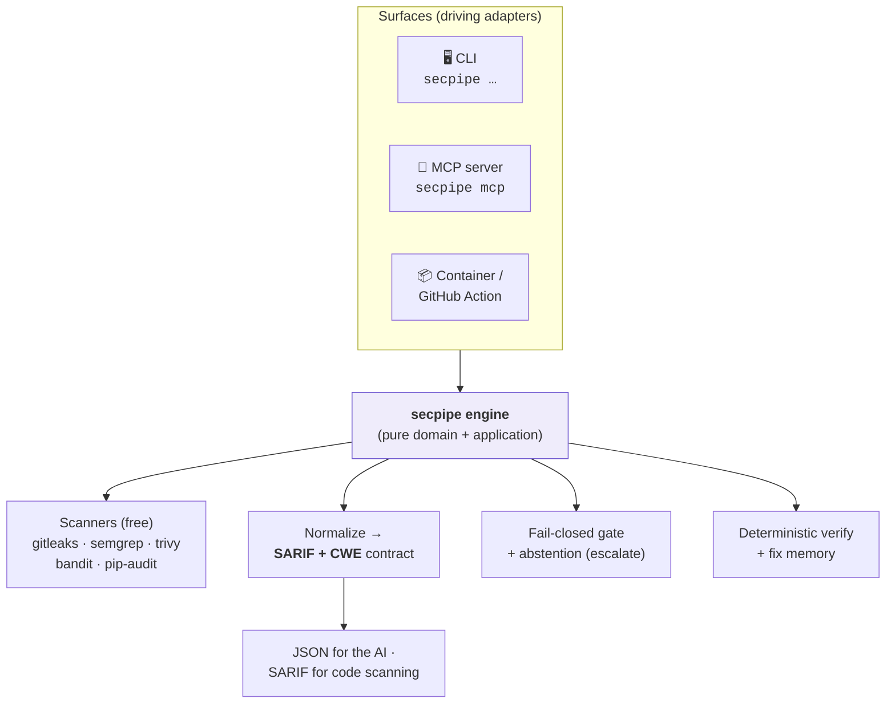
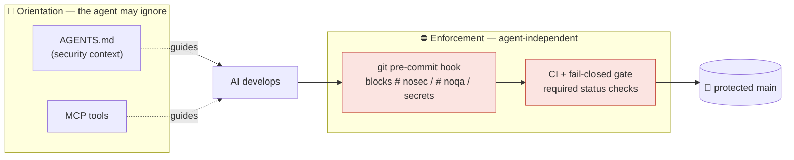
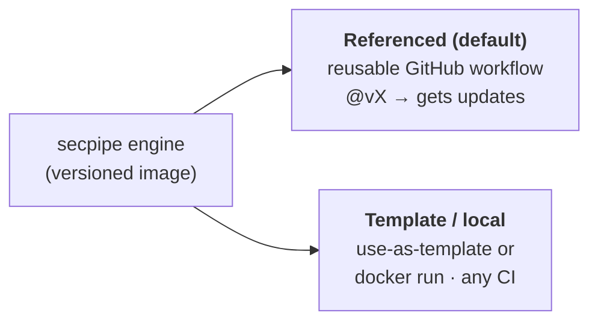
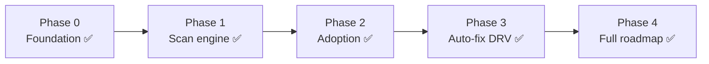

<div align="center">

# 🛡️ secpipe

### The zero-cost security pipeline your **AI operates itself** — so every AI-built project ships secure.

[](https://github.com/pablodlz/secpipe-ai/actions/workflows/ci-security.yml)
[](LICENSE)
[](https://github.com/pablodlz/secpipe-ai/pkgs/container/secpipe-ai)
[](pyproject.toml)
[](#-mcp-the-agent-native-interface)


**Language-agnostic · AI-agnostic · Keyless · Self-hosted · Composes best-of-breed free tools**

</div>

---

> **AI writes code fast — and introduces vulnerabilities at scale.** secpipe makes the *same* AI that
> writes your code **find, fix, and verify** those vulnerabilities, guided by rules it can't quietly
> bypass. No API key. No SaaS bill. No human in the loop for the routine 80% — only for the risky 20%.

secpipe is a **DevSecOps engine designed to be operated by an AI agent** (Claude Code, Cursor, Copilot, Aider…).
You apply it to a project *before* development starts; from then on, the project's AI develops **secure by
default** — scanning, fixing, and verifying its own work behind guardrails enforced by your git hooks and CI,
not by the AI's goodwill.

It's **free by construction** (only free/open-source scanners), **runs anywhere** (container, any CI, or local),
and works with **any language** and **any AI**.

---

## ✨ Why secpipe is different

|  | **secpipe** | Copilot Autofix | Snyk / Mobb / Semgrep Assistant |
| --- | :---: | :---: | :---: |
| **Cost** | **$0, self-hosted** | free for OSS only | paid / metered |
| **Needs its own AI API key** | **No** — the agent already runs | — | Yes (account) |
| **Fixes findings from any scanner** | **Yes** (SARIF+CWE) | CodeQL only | varies |
| **Operated by the AI itself (MCP-native)** | **Yes** | No | No |
| **Verifier that doesn't trust the AI's word** | **Deterministic** (scanner + tests + no-suppression) | — | — |
| **Enforcement the AI can't bypass** | **git hooks + CI** | — | — |
| **Runs offline / no external service** | **Yes** | No (cloud) | No |

The core insight: **the operator is the AI.** So secpipe doesn't embed an LLM (and needs no key) — it provides
the **findings, the deterministic judge, and the guardrails**; the AI agent that's already running does the fixing.

---

## 🔁 How it works — the Detect → Repair → Verify loop



- **DETECT** — `secpipe scan` runs the scanners, normalizes every result into one contract (`cwe`, `severity`,
  `file`, `line`, `fingerprint`, `escalate`), dedups, and applies a **fail-closed gate**.
- **REPAIR** — the AI agent reads the structured findings and fixes them with its own model (or `secpipe fix`
  applies deterministic codemods for the mechanical ones). **No key needed.**
- **VERIFY** — `secpipe verify` is the **deterministic, independent judge**: it accepts a fix *only* if the
  scanner no longer flags it, the diff adds **no suppression**, and the tests pass. The *machine* approves — never
  the agent's word. Anything sensitive is **escalated**, not auto-fixed.

---

## 🚀 Quickstart

```bash
# 1. Install the engine + free scanners (Windows / Linux / macOS)
python install.py            # or: ./setup.sh  |  .\setup.ps1

# 2. Adopt secpipe in any project (one command)
secpipe init                 # writes .secpipe.yml + AGENTS.md + git hook + CI workflow + .mcp.json

# 3. The loop
secpipe scan .               # DETECT — JSON findings for the AI (or --format sarif for GitHub code scanning)
secpipe fix .                # REPAIR — apply deterministic codemods (the rest is the agent's job)
secpipe verify .             # VERIFY — deterministic gate + no-suppression + tests
```

Prefer zero install? The published container has **everything** baked in:

```bash
docker run --rm -v "$PWD:/work" ghcr.io/pablodlz/secpipe-ai:latest scan /work
```

`secpipe init` is **plug-and-play**: zero-config works out of the box with strong, secure defaults — the
`.secpipe.yml` is optional and only there to tune, never to weaken.

---

## 📋 Step-by-step — add secpipe to *your* project

> **Who does what.** *You* wire secpipe in **once** (a handful of generated files, one commit). From then on
> **your AI agent operates it** — it reads `AGENTS.md`, runs the loop, and fixes findings. **No API key, ever:**
> the operator is the agent you already use (Claude Code, Cursor, Copilot…), not a paid service.

**Prerequisites:** a Git repository (GitHub recommended) and either **Docker** *or* **Python 3.11+**.

### 1 · Install the engine

Pick one path:

```bash
# A) Zero install — the published image has all 5 scanners baked in (best for CI)
docker pull ghcr.io/pablodlz/secpipe-ai:latest

# B) Local CLI + scanners — to run the loop on your machine
pip install git+https://github.com/pablodlz/secpipe-ai.git
python install.py     # installs the free scanners  (or ./setup.sh | .\setup.ps1)
secpipe doctor        # shows which scanners are on your PATH
```

### 2 · Adopt it — one command at your repo root

```bash
secpipe init
```

It detects your languages and writes these files (idempotent — it **never** clobbers what you already have):

| File | What it's for | Commit it? |
| --- | --- | --- |
| `.secpipe.yml` | your scanner list + gate — **tune-only**, it can't weaken the defaults | ✅ |
| `.github/workflows/security.yml` | the CI gate — calls the reusable engine at `@v1` | ✅ |
| `AGENTS.md` | the contract your AI reads **before writing code** | ✅ |
| `.mcp.json` | wires the MCP server so the agent calls secpipe natively | ✅ |
| `CLAUDE.md` | shim pointing Claude Code at `AGENTS.md` | ✅ |
| pre-commit hook | anti-suppression guardrail — **merged into** your existing `.pre-commit-config.yaml` (or a native git hook) | ✅ |

### 3 · Commit & push — the gate goes live

```bash
git add .secpipe.yml .github/ AGENTS.md .mcp.json CLAUDE.md .pre-commit-config.yaml
git commit -m "chore(security): adopt secpipe"
git push
```

On every push/PR, `security.yml` runs `docker run …/secpipe-ai:latest scan` — all scanners, straight from the
**public** image, so **your CI needs no login or secret**. Any **HIGH/CRITICAL** finding **fails the build**
(fail-closed). There is nothing else to configure.

### 4 · Let your AI operate the loop

While you build, your agent runs **Detect → Repair → Verify** (locally, or over MCP):

```bash
secpipe scan .     # DETECT  — CWE-tagged JSON findings the AI consumes
secpipe fix .      # REPAIR  — deterministic codemods; the agent fixes the rest
secpipe verify .   # VERIFY  — deterministic judge: gate + no-suppression + your tests
```

The agent **cannot** silence a finding to go green (the guardrail below blocks it), and sensitive classes
(auth / crypto / secrets) are **escalated to you**, never auto-fixed.

### 5 · Pick your adoption model *(optional)*

- **Referenced (default)** — `security.yml` pins `…/secpipe.reusable.yml@v1`; bump the tag to get engine
  updates. Best for most projects.
- **Template / vendored** — use-as-template, or just `docker run …` in any CI (GitLab, Jenkins…). Best when
  you can't reference across repos.

> **Net human effort:** one `secpipe init` + one commit. Everything after that is the agent and the gate.
> Verify anytime with `secpipe doctor` and your repo's **Actions** tab.

---

## 🧩 Architecture — one engine, three surfaces

secpipe is a small, pure-domain core (Clean + Hexagonal) with swappable adapters and **three thin entrypoints**.
CI/CD speaks the CLI/container; the AI agent speaks **MCP**.



**Composes best-of-breed, doesn't reinvent.** The scanners, remediation (Codemodder), and supply-chain checks
(OpenSSF Scorecard, StepSecurity Harden-Runner) are proven free tools. secpipe's value is the **glue**: one
AI-friendly contract, the deterministic verifier, the guardrails, and the agent-native interface.

---

## 🔒 The guardrail: *who guards the guard?*

If the same AI writes the code, runs the gate, **and** fixes findings, what stops it from just… silencing a
finding to go green? This is the hardest problem in AI-operated security — and secpipe answers it by separating
**orientation** (advice the agent could ignore) from **enforcement** (structural, agent-independent):



- **A fix is never "make CI green."** The pre-commit hook **blocks** any diff that adds `# nosec` / `# noqa` /
  `nosemgrep` or a staged secret. The gate is **fail-closed** (unknown/error ⇒ block).
- **The policy lives in the engine**, not in the consumer repo — the AI can't rewrite the ruler that judges it.
- **The verifier is deterministic** — objective evidence (scanner + tests), not the model's self-assessment.

*This lesson was learned the hard way in offensive security (a guard that taught its own bypass); secpipe bakes
the fix in from commit zero.*

---

## 🤖 MCP — the agent-native interface

`secpipe init` registers an **MCP server** (`.mcp.json`). Any MCP-capable agent gets first-class tools and drives
the loop with **structured JSON**, no shell parsing:

| Tool | Purpose |
| --- | --- |
| `secpipe_scan` | DETECT — findings + gate verdict |
| `secpipe_fix` | REPAIR — deterministic codemods |
| `secpipe_verify` | VERIFY — deterministic judge |
| `secpipe_recall` / `secpipe_remember` | verified-fix memory (patterns, never code) |
| `secpipe_doctor` | tool availability |
| `secpipe_threat_model` | STRIDE threat-model scaffold (keyless) |
| `secpipe_sbom` | Software Bill of Materials (CycloneDX/SPDX) |

The server is **JSON-RPC 2.0 over stdio, stdlib-only** (zero external dependency — a smaller supply-chain surface,
fitting for a security tool) and **local** by design. It's the *ergonomic* layer; enforcement stays in the hooks + CI.

---

## 🛠️ Commands

| Command | What it does |
| --- | --- |
| `secpipe init` | Adopt secpipe in a project (config + `AGENTS.md` + hook + workflow + `.mcp.json`) |
| `secpipe scan [--format json\|sarif\|html\|md\|github] [--enrich] [--diff-base REF] [--reachability]` | Run scanners, normalize, apply the gate |
| `secpipe fix [--dry-run]` | Apply deterministic codemods |
| `secpipe verify [--base REF]` | Deterministic judge: gate + no-suppression + tests |
| `secpipe autofix --headless` | **Opt-in, keyed** AI PR-bot: fix → deterministic verify → open PR (never auto-merge) |
| `secpipe threat-model [--format md\|json\|threat-dragon]` | STRIDE threat-model of your app (keyless; framework-aware) |
| `secpipe import <file.sarif>` · `dast-import <zap.json>` | Normalize any external SARIF / ZAP report into the gate |
| `secpipe image <ref>` · `sbom [--format cyclonedx\|spdx]` · `badge` | Container-image scan · SBOM · SVG badge |
| `secpipe report --defectdojo` | Export findings to DefectDojo (opt-in, keyed) |
| `secpipe config-validate` · `policy-lock` · `policy-check` · `waiver-list` | Policy tooling (anti-tamper, exceptions) |
| `secpipe hook` · `mcp` · `remember`/`recall` · `doctor` · `version` | Enforcement · MCP server · fix-memory · tools · version |

---

## 🧰 What's inside (all free)

| Dimension | Tools / capabilities composed |
| --- | --- |
| **SAST** | Semgrep CE · Bandit (Python) · **gosec** (Go) |
| **SCA** | Trivy · pip-audit · **npm-audit** · **osv-scanner** (multi-ecosystem) |
| **Secrets** | gitleaks (filesystem **+ full git history**) |
| **IaC / containers** | Trivy · **Checkov** (Terraform/K8s/CFN) · **hadolint** (Dockerfile) · **`trivy image`** |
| **DAST** (opt-in) | OWASP ZAP — **baseline / full / authenticated** · DAST↔SAST correlation |
| **Malicious deps** | **typosquat · dependency-confusion · install-hook** (offline heuristic) |
| **License** | SPDX **deny/allow** policy (via Trivy) |
| **Prioritization** | **EPSS + CISA KEV** (KEV blocks) · reachability-lite · triage hints |
| **Threat modeling** | STRIDE scaffold, keyless · **framework-aware** · **Threat Dragon** export |
| **Remediation** | Codemodder (deterministic) · **headless AI PR-bot** (opt-in, verified) |
| **Policy engine** | fail-closed **coverage gate** · **policy-as-code** · **waivers** · **diff-scope** · **gate-integrity lock** |
| **Reporting** | JSON · SARIF · HTML · Markdown · GitHub annotations · badge · DefectDojo |
| **Supply-chain (engine)** | **SBOM (CycloneDX)** · **cosign keyless signing** · **SLSA provenance** · SHA-pinned actions · OpenSSF Scorecard · Harden-Runner · Dependabot |

Missing tools simply `skip` (they never break the run); a scanner that **errors** trips the **fail-closed** gate.
The published image bundles all scanners, is **signed** (keyless), and the reusable workflow **pins it by digest**.

---

## 📥 Adoption models — GitHub-first, with a fallback



Both modes consume the **same versioned engine** — you adapt only a tiny `.secpipe.yml` + a thin wrapper, never
the logic. That's how secpipe stays reusable **without drift**.

---

## 🛡️ Security posture (it eats its own dog food)

secpipe's own repository is its **first consumer**: every push runs the pipeline on itself.

- **Fail-closed everywhere** · secrets never committed (gitleaks in CI + pre-commit)
- **Supply-chain hardened** · all GitHub Actions **pinned by commit SHA** · container binaries verified by **SHA-256**
- **OpenSSF Scorecard** + **Harden-Runner** (egress monitoring) + **Dependabot** · `main` is branch-protected
- **Strict quality gate** on every change · Ruff (incl. Bandit rules) + mypy `--strict` + Bandit + tests

See [`SECURITY.md`](SECURITY.md) and the threat model in [`docs/specs/03-security.md`](docs/specs/03-security.md).

---

## 📈 Status & roadmap

**Roadmap complete (v0.6.0):** **8+ scanners** (SAST/SCA/secrets/IaC/DAST/malicious-deps/license/image) ·
**EPSS + KEV** prioritization · **STRIDE threat-model** (framework-aware + Threat Dragon) · **keyless
Detect→Repair→Verify** + **headless AI PR-bot** (opt-in) · full **policy engine** (coverage-gate · policy-as-code ·
waivers · diff-scope · gate-integrity lock) · reporters (JSON/SARIF/HTML/MD/badge/annotations) · **DefectDojo**
export · **SBOM + cosign keyless signing + SLSA provenance** · MCP server · **signed, digest-pinned** image · green CI.



Full plan and design specs live in [`docs/specs/`](docs/specs/) (foundation-to-features, incl. the strategies
distilled from prior art) and the decisions in [`docs/adr/`](docs/adr/).

---

## ❓ FAQ

**Do I need an OpenAI/Anthropic API key?** No. The AI operating your project already has model access — *it*
does the fixing. secpipe provides the findings, the deterministic judge, and the guardrails. (A headless
"PR-bot" mode that calls an LLM itself is an optional future add-on — that one would need a key.)

**Which languages?** Any. The engine runs as a container; the scanners are multi-language. Python-specific
scanners (Bandit, pip-audit) auto-enable when Python is detected.

**Which AI agents?** Any. `AGENTS.md` is the neutral standard (with optional shims for Claude/Cursor/Copilot),
and the MCP server works with any MCP-capable agent. Crucially, enforcement (hooks + CI) is **agent-independent**.

**Is it really free?** Yes — only free/OSS scanners, self-hosted, no metering. `semgrep`/`codemodder` don't run
natively on Windows (they run in the Linux container/CI); everything else runs on Windows too.

**Can it just silence findings to pass?** No — that's the whole design. Suppression is blocked at commit time,
the policy isn't editable by the consumer, and the verifier is deterministic.

---

## 🤝 Contributing & License

Contributions are welcome — issues and PRs. All changes go through the same green gate secpipe applies to
everything else.

Licensed under **[Apache-2.0](LICENSE)** — permissive, with an explicit patent grant (fitting for security tooling).

<div align="center">

*Built to be the best zero-cost security pipeline on the market — operated by AI, for AI-built software.*

</div>
